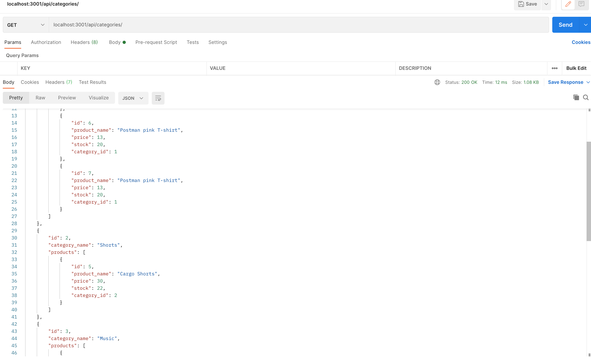

# E-commerce Backend [](https://github.com/sindresorhus/awesome#readme)  

  ## Description  
  The current project is functioning backend for a store, it uses sequalize orm to handle model queries. It needs to be used with insomnia or postman to test out the current endpoints as it has no frontEnd, but can easily be integrated with a UI.

  ## Table of Contents  
  - [Description](#description)
  - [Installation](#installation)  
  - [Usage](#usage)  
  - [License](#license)  
  - [Contributing](#contributing)  
  - [Test](#test)  
  - [Questions](#questions) 
  - [Images](#images) 
 
  ## Installation  

  ```
  npm i sequalize express dotenv mysql  
  ```
  ## Usage  

  ```
  npm start   
  ```   
  Refer to the ScreenShots in the deployed section to see what the results look like from the endpoints.
  ## License  
  
    

  ## Contributing  

  No contributors yet  

  ## Test  
  ```
    npm run seed
  ```   
  For testing with random data, will seed a database.   
  Also you can test the routes out using insomnia, or postman like I did.  

  Refer to the Walkthough video for guidence  
  [Walkthough Video](https://drive.google.com/file/d/1D9wlXRUMy4kAzsX6TL5cA9AAZDxCqKKu/view)
  ## Questions  

  Please email me directly for any questions.  

  ## Images  
    
    
  
  